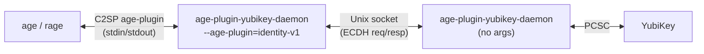

# age-plugin-yubikey-daemon

A PIN-caching daemon for [age-plugin-yubikey](https://github.com/str4d/age-plugin-yubikey) decryption. Enter your YubiKey PIN once, then decrypt with just a touch for the rest of the session.

Inspired by Filippo Valsorda's [passage workflow](https://words.filippo.io/passage/), where he describes wanting to avoid retyping the PIN. His planned approach talks to `yubikey-agent` (his SSH agent); this project takes a different path — holding its own PCSC session to cache the PIN-verified state directly.

## Problem

`age-plugin-yubikey` opens a fresh PCSC session for every decryption, which means the YubiKey's "Once" PIN policy doesn't help — you're prompted for your PIN every time. This daemon holds a persistent PCSC session so the PIN only needs to be entered once.

```
# Without the daemon:
$ passage show -c github.com/token    # PIN + touch
$ passage show -c email/password      # PIN + touch (again)
$ passage show -c ssh/key             # PIN + touch (again)

# With the daemon:
$ passage show -c github.com/token    # PIN + touch (first time)
$ passage show -c email/password      # touch only
$ passage show -c ssh/key             # touch only
```

## How it works

A single binary that dispatches on its CLI arguments:



- **No args** — Daemon mode. Holds a persistent PCSC session to the YubiKey, listens on a Unix socket in `$XDG_RUNTIME_DIR`, caches PIN verification for the lifetime of the session. This is what the systemd unit launches.

- **`--age-plugin=identity-v1`** — Invoked automatically by `age` when it encounters `AGE-PLUGIN-YUBIKEY-DAEMON-` identities. Speaks the [C2SP age-plugin protocol](https://c2sp.org/age-plugin) on stdin/stdout, proxies ECDH operations to the daemon.

- **`<file>`** — Any argument that isn't `--age-plugin=…` is treated as the path to an identity file. A one-shot utility that re-encodes `AGE-PLUGIN-YUBIKEY-` identities in `<file>` as `AGE-PLUGIN-YUBIKEY-DAEMON-` so that `age` routes decryption through this daemon.

The original `age-plugin-yubikey` is left untouched — it still handles key generation, identity listing, and encryption. This daemon only handles decryption.

## Plugin call path

How `age -d` ends up talking to this daemon, from identity to file key:

1. **`age` selects the plugin.** An identity with the bech32 HRP `AGE-PLUGIN-YUBIKEY-DAEMON-` maps, by C2SP convention, to a binary named `age-plugin-yubikey-daemon` on `$PATH`. `age` spawns it as `age-plugin-yubikey-daemon --age-plugin=identity-v1` and speaks the age-plugin protocol over stdin/stdout.
2. **Dispatch.** The binary hands `identity-v1` to `age_plugin::run_state_machine`, which drives the protocol and calls back into our `IdentityPlugin`. (Recipient-v1 is refused — encryption stays with `age-plugin-yubikey`.)
3. **`add_identity` (accumulate).** `age` feeds each identity in, one call at a time. We decode the bech32 payload into a stub — `serial (4 LE) | slot (1) | tag (4)` — and remember it. The `tag` is the join key for the next phase.
4. **`unwrap_file_keys` (the work).** `age` makes a single call carrying every file's header stanzas — **all of them, including stanzas for other recipients and plugins** (see below). For each file we:
    - keep only well-formed `piv-p256` stanzas (`from_stanza`), then keep only those whose tag matches an identity from step 3 (the tag join);
    - `probe_key` the daemon — serial/slot/tag check on the card, no PIN or touch;
    - `ecdh` on the daemon — prompting for the PIN once (then a touch) — to get the shared secret;
    - derive the file key: HKDF over the ephemeral and recipient public keys, then AEAD-unwrap the stanza body.
5. **Return.** Unwrapped file keys go back to `age`, which decrypts the payload. Files we can't (or weren't meant to) unwrap simply get no entry.

## Security

- **PIN is not persistently cached.** The "authenticated" state lives on the YubiKey hardware for the lifetime of the PCSC session, not in process memory — the daemon never stores the PIN. The PIN does transit the daemon's memory to reach the YubiKey's `VERIFY PIN` command; the daemon's owned copy is zeroized after use, though transient copies inside the RPC transport's serialization buffers cannot be wiped and persist in freed heap until reused.
- **Touch is still required for every decryption.** This is enforced by the YubiKey hardware (touch policy "Always") and cannot be bypassed by software.
- **Access control rides on the runtime directory.** The socket lives under `$XDG_RUNTIME_DIR` (mode `0700`, owned by your user), so no other user can traverse to it regardless of the socket file's own mode. Under the systemd unit the socket itself is `0600` (`UMask=0177`); run by hand it inherits your umask, but the `0700` parent is the guarantee.
- **Systemd hardening.** The service runs with `ProtectSystem=strict`, `ProtectHome=read-only`, `NoNewPrivileges=yes`, `PrivateTmp=yes`.
- **Typed RPC, not hand-rolled parsing.** The plugin and daemon speak a small two-method tarpc service (`probe_key`, `ecdh`) serialized with bincode. Requests deserialize into fixed-shape typed values — a serial, a slot byte, a 4-byte tag, a P-256 point that is validated on-curve before use, and an optional PIN — rather than being picked out of a raw byte buffer by hand.
- **No unsafe code.**

### What happens if...

| Scenario                                      | Result                                                                                                                                                                                                                            |
| --------------------------------------------- | --------------------------------------------------------------------------------------------------------------------------------------------------------------------------------------------------------------------------------- |
| Daemon not running                            | Plugin reports error, `age` shows message to start the daemon.                                                                                                                                                                    |
| YubiKey removed                               | Daemon detects on the next request, drops the stale handle, then transparently reconnects when the YubiKey is re-inserted. The PIN cache is cleared (the chip was power-cycled), so the next operation prompts for the PIN again. |
| Daemon started before YubiKey inserted        | Daemon binds its socket immediately and opens the YubiKey lazily on the first request; until one is present, requests return a "chip unavailable" / "disconnected" error                                                          |
| Different YubiKey (different serial) inserted | Each request carries the identity's serial; the daemon checks it against the connected chip and rejects with a serial-mismatch error if they differ                                                                               |
| Wrong PIN                                     | Daemon rejects with the remaining-tries count; the plugin reports the error for that file (no automatic re-prompt)                                                                                                                |
| Another user tries to connect                 | Socket permissions deny access                                                                                                                                                                                                    |

## Installation

### Arch Linux

```sh
makepkg -si
systemctl --user enable --now age-plugin-yubikey-daemon.socket
```

### Convert existing identities

Your existing `AGE-PLUGIN-YUBIKEY-` identities need to be converted to `AGE-PLUGIN-YUBIKEY-DAEMON-` so that `age` invokes this daemon instead of the original plugin:

```sh
age-plugin-yubikey-daemon ~/.config/passage/identities
```

This re-encodes each identity with the new bech32 Human-Readable Part (HRP) and updates the checksum. The underlying key data is unchanged — same serial, slot, and tag.

Your existing identities are kept in a `.bak` file.

## Usage

Once installed and identities converted, `passage` and other `age`-based tools work as before — the daemon is invoked automatically:

```sh
# First decryption: prompts for PIN + touch
passage show github.com/token

# Subsequent decryptions: touch only
passage show email/password
passage show ssh/key
```

To stop caching and require PIN again:

```sh
systemctl --user restart age-plugin-yubikey-daemon
```

## Protocol

tarpc protocol over a Unix socket at `$XDG_RUNTIME_DIR/com.brongan.age-plugin-yubikey-daemon/daemon.sock`.

## Glossary

| Term                                                                  | Meaning                                                                                                                                                                                                                                                                                   |
| --------------------------------------------------------------------- | ----------------------------------------------------------------------------------------------------------------------------------------------------------------------------------------------------------------------------------------------------------------------------------------- |
| **[age](https://age-encryption.org/)**                                | A modern file encryption tool. Identity-based, no config files, composable via plugins.                                                                                                                                                                                                   |
| **[age-plugin-yubikey](https://github.com/str4d/age-plugin-yubikey)** | An age plugin that stores encryption keys on a YubiKey via the PIV applet.                                                                                                                                                                                                                |
| **[C2SP age-plugin](https://c2sp.org/age-plugin)**                    | The Community Cryptography Specification Project's spec for age plugins — defines the stdin/stdout protocol between `age` and plugin binaries.                                                                                                                                            |
| **ECDH**                                                              | [Elliptic-Curve Diffie-Hellman](https://en.wikipedia.org/wiki/Elliptic-curve_Diffie%E2%80%93Hellman) — a key agreement protocol. The sender encrypts a file key using the recipient's public key; the YubiKey performs the private-key half of the exchange to recover the shared secret. |
| **[PC/SC](https://pcsclite.apdu.fr/)**                                | Personal Computer/Smart Card — the standard API for communicating with smart cards (including YubiKeys). A "PCSC session" is an open connection to the card reader.                                                                                                                       |
| **[PIV](https://csrc.nist.gov/pubs/sp/800/73/4/final)**               | Personal Identity Verification (NIST SP 800-73) — the smart card applet on YubiKeys that stores X.509 certificates and performs crypto operations.                                                                                                                                        |
| **PIN policy "Once"**                                                 | A YubiKey PIV setting: the PIN must be verified once per PCSC session, then all subsequent operations in that session skip the PIN prompt.                                                                                                                                                |
| **Touch policy "Always"**                                             | A YubiKey PIV setting: physical touch is required for every cryptographic operation, regardless of PIN state.                                                                                                                                                                             |
| **Stanza**                                                            | An age-encrypted file contains one stanza per recipient. Each stanza holds the encrypted file key wrapped to that recipient's public key.                                                                                                                                                 |
| **[passage](https://github.com/FiloSottile/passage)**                 | An age-based password store (like `pass`, but using `age` instead of GPG).                                                                                                                                                                                                                |

## License

MIT OR Apache-2.0
